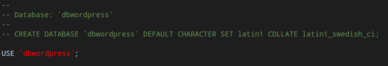

This article describes: how to migrate a hosted (Host Europe via Plesk) wordpress (wp) site to Amazon Web Service (AWS).

## Step 1: Copy your old wp-site and DB

* Login to you existing web host via e.g. Remote Desktop Connection (RDC)
* Simply download the whole wordpress folder. For instance the wp folder at the Host Europe web server is called httpdocs.
* Now one has to dump the database (DB). In order to do that go to the phpmyadmin page. The link should look similar to: 
https://IP_Address:Port/domains/databases/phpMyAdmin/index.php?pleskStartSession  
* On the phpmyadmin page go to the DB which is connected to you wp-site. This DB contains all the posts and references you have done while working with the wb Content Management System (CMS).
* Then do the following steps: 
    + Go to: Export
    + Click on: Custom - display all possible options
    + Select all: Table(s)
    + Select: Format SQL
    + <color class="red">IMPORTANT!</color> Check mark the: Add DROP TABLE / VIEW / PROCEDURE / FUNCTION / EVENT statement
    + The rest of the default configuration should be just fine.

## Step 2: Create a wp-site in AWS

* Create a AWS account:  https://aws.amazon.com/  
As long as you choose the cheapest options the website should be for free, but the traffic will be limited.
* Follow the following setup of a wp-website:  http://docs.aws.amazon.com/getting-started/latest/wordpress/hosting-wordpress-on-aws.html   
<color class="red">While you are following the tutorial make some minor changes:</color>
    + Step 2: Choose the DB configuration (DB Name, Password, etc.) as close as possible to the original DB.
    + Step 3: Don't download a new WordPress instance. It will be replaced by your downloaded wp-site. 
    + Step 4: Simple deploy your downloaded wp-site. <color class="red">CAREFUL:</color> There should not be a nested folder in you root folder.
     \- root 
    \-\- wordpress (<color class="red">wrong</color>) 
    \-\-\- wp structure  
      \- root  
    \-\- wp structure (<color class="green">correct</color>)

## Step 3: Upload your wp-site and modify the dumped SQL file.
  
* If one has misted to upload the wp-site, it can also be uploaded directly by means of the Elastic Beanstalk environment.
* Now open the SQL file via you favoured editor. 
    + Search for the "Database:" take, which should be at the beginning of the SQL file. 
    + Commend out: "CREATE DATABASE `dbwordpress` DEFAULT CHARACTER SET latin1 COLLATE latin1_swedish_ci"
    + If the "USE" tag does not exist, include it; followed by your RDS_DB_Name you have specified in your Relational Database Service (RDS). 
      
    + Last but not least, replace ALL your previous IP addresses with the new URL from AWS. (One can change it back later in the wp CMS)
* Connect with you RDS via e.g. MySQL Workbench or equivalent:   https://dev.mysql.com/downloads/workbench/  
    + Go to: Data Import/Restore
    + Mark: "Import from Self Contained File" and search after the file on your system ;)
    + Select you database at: Default Target Schema
    + Press: Start Import  
If everything works fine the RDS will be updated to the SQL file you have copied from you previous wp-site.
    
## Nodes

That's it, if everything works fine you should be able to launch your new migrated site. Probably, I got luck along the way and did not fall in all pitfalls. Anyway, that are the steps to migrate a wp-site to AWS. Hope it helps some of you. 
